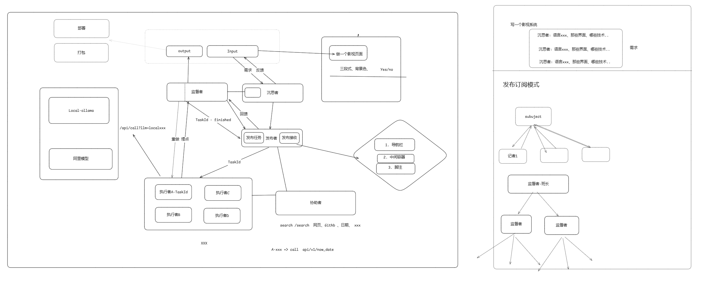

# 多流程 Agent 项目

[English](README.md)

## 项目概述

该项目旨在实现一个多流程 Agent 系统，通过结合本地 Ollama 的接口，处理复杂的多流程任务。每个 Agent 专注于不同的角色，如 DevOps 工程师、程序员、需求分析师等，它们通过共享上下文信息协同工作。项目还探索了异步编程技术，以提高系统的响应速度和效率。

## 项目初衷

> 随着 AI 的发展, 多 Agent 协作完成各种任务是必然的趋势, 本项目旨在实现脑海中的各种构思，力求实现一个多流程 Agent 系统，设计了一套架构体系,并采用 Go、Python、低代码工作流都实现了一遍，实现细节各有差异，但核心逻辑差不多。随着不断实践发现，纯代码编写整个流程复杂度会递增尤其是各种云端模型调用耗时过长，需要系统的可靠以及可追溯。实践表明: 采用 MCP 协议 亦或者 利用小模型做快速的工具提取 对于外部调用工具会更为便捷。而整个 Agent 的设定不应该局限于具体的事物，而应该是整个流水线不断迭代下去，最终实现自给自足到项目部署上线整个流程。项目指出: 大模型采用更加详细更加具有约束性的提示词，所取得的效果是非常显著的，例如 ScreenToCode 项目，核心逻辑就是: 调用大模型按照指定提示词来做图片的识别输出.

### 预期架构设计

### 实际产物

| 项目                                                   | 描述                                                                                                        |
| ------------------------------------------------------ | ----------------------------------------------------------------------------------------------------------- |
| [agent-fastpy](agent-fastpy)                           | Python + Fastapi + React 实现了一个简易的流程管理                                                           |
| [agent_playground](agent_playground)                   | Python 实现了一个纯命令行附带多任务步骤流的 Agent                                                           |
| [think-work](https://hub.oomol.com/package/think-work) | 采用 [oomol](https://oomol.com/zh-CN/) 低代码实现了整个流程的 Agent，用于快速给定需求编写指定前端需要的架子 |

## 协议

[GPL](LICENSE)
